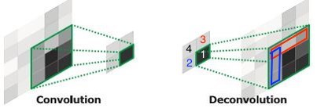
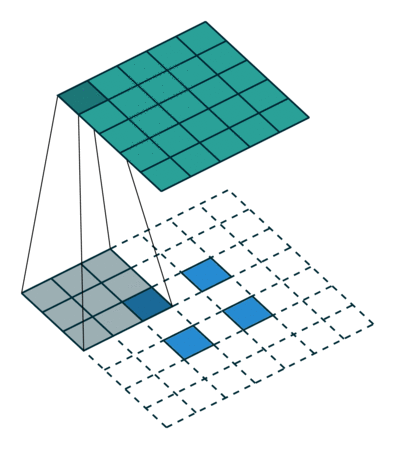

# Transpose CONV

走了不少弯路，但其实Transpose CONV很简单

参考：   
论文[Deconvolutional Networks](http://www.uoguelph.ca/~gwtaylor/publications/mattcvpr2010/deconvolutionalnets.pdf)    
git 项目[conv_arithmetic](https://github.com/vdumoulin/conv_arithmetic)   
​    
​    

[TOC]


## 1、inference 时如何计算



上图左侧是普通卷积，no padding，stride=2；右侧是**反卷积**，正好是左侧的反。   
**反卷积**的具体计算是：   
（1）输入的每个点，都作为一个放大倍率，去乘以 kernel 中的 Weight 矩阵。标量乘矩阵，得到矩阵，*一个“点”扩大为一个“小平面”*。   
例如，上图中1号点，扩大为绿色框那么大。

（2）各个“点”扩大成的各个“小面”，根据空间位置和 stride 值，排布成为一个“大平面”。各个“小面”之间如果有 overlap，就把 overlap 的矩阵元素相加。(**注意：反卷积时，stride 值是用于各个“小平面”在排布时，怎样去拼接**)   
例如，1号点 和 2号点 扩大为的两个“小面”在蓝框的位置有 overlap；   
1号点 和 3号点 扩大为的两个“小面”在红框的位置有 overlap；   
红框、蓝框都有的那个点，是四个“小面”都 overlap 的地方；

（3）如果有多个 channel，**一个“点”扩大为一个“小立方块”**。   
各个“小立方块”，在H、W 方向上，根据空间位置和 stride 值，排布成一个更高更宽的“大立方块”。   
C 方向全是 overlap，out channel 和 kernel 的 channel 数值一致。

（4）git 项目[conv_arithmetic](https://github.com/vdumoulin/conv_arithmetic) 给出的动图，也能从另一个角度帮助思考：

先是正向的普通卷积，no padding，stride=2


再是反向的**反卷积**，也是no padding，stride=2



## 2、TensorFlow 实际试验

```python
import numpy as np
import tensorflow as tf

tf.reset_default_graph()
# [batch, height, width, channel]
x_image = tf.placeholder(tf.float32,shape=[2,2])
x = tf.reshape(x_image,[1,2,2,1])

W_cpu = np.array([[1,2,3,4,5,6,7,8,9]],dtype=np.float32)
W = tf.Variable(W_cpu)
W = tf.reshape(W, [3,3,1,1]) 
#A 4-D `Tensor` with the same type as `value` and shape
#`[filter_height, filter_width, out_channels, in_channels]`.

strides=[1, 2, 2, 1]
padding='VALID'

y = tf.nn.conv2d_transpose(x, W, [1,5,5,1],strides, padding)


x_data = np.array([[1,1],[1,1]],dtype=np.float32)
with tf.Session() as sess:
    init = tf.global_variables_initializer()
    sess.run(init)

    x = (sess.run(x, feed_dict={x_image: x_data}))
    W = (sess.run(W, feed_dict={x_image: x_data}))
    y = (sess.run(y, feed_dict={x_image: x_data}))

    print ("The shape of x:\t", x.shape, ",\t and the x.reshape(2,2) is :")
    print (x.reshape(2,2))

    print ("The shape of W:\t", W.shape, ",\t and the W.reshape(3,3) is :")
    print (W.reshape(3,3))

    print ("The shape of y:\t", y.shape, ",\t and the y.reshape(5,5) is :")
    print (y.reshape(5,5))
```

代码如上，实现了图片右侧的**反卷积**，运行打印如下。

（1）输入的1~4个点，值都为1。weight 矩阵的值是1~9。no padding，stride=2。

可以看到，红框、蓝框都有的那个点，是四个“小面”都 overlap 的地方，其值=1+3+7+9 = 20。   
图中红色框内另两个点的值 = [8,9] + [2,3] = [10,12]。     
图中红色框内另两个点的值 = [4,7] + [6,9] = [10,16]。 

```
The shape of x:	 (1, 2, 2, 1) ,	 and the x.reshape(2,2) is :
[[ 1.  1.]
 [ 1.  1.]]
The shape of W:	 (3, 3, 1, 1) ,	 and the W.reshape(3,3) is :
[[ 1.  2.  3.]
 [ 4.  5.  6.]
 [ 7.  8.  9.]]
The shape of y:	 (1, 5, 5, 1) ,	 and the y.reshape(5,5) is :
[[  1.   2.   4.   2.   3.]
 [  4.   5.  10.   5.   6.]
 [  8.  10.  20.  10.  12.]
 [  4.   5.  10.   5.   6.]
 [  7.   8.  16.   8.   9.]]
```
（2）其他不变，把 stride增大为3。打印如下：

```
The shape of x:	 (1, 2, 2, 1) ,	 and the x.reshape(2,2) is :
[[ 1.  1.]
 [ 1.  1.]]
The shape of W:	 (3, 3, 1, 1) ,	 and the W.reshape(3,3) is :
[[ 1.  2.  3.]
 [ 4.  5.  6.]
 [ 7.  8.  9.]]
The shape of y:	 (1, 6, 6, 1) ,	 and the y.reshape(6,6) is :
[[ 1.  2.  3.  1.  2.  3.]
 [ 4.  5.  6.  4.  5.  6.]
 [ 7.  8.  9.  7.  8.  9.]
 [ 1.  2.  3.  1.  2.  3.]
 [ 4.  5.  6.  4.  5.  6.]
 [ 7.  8.  9.  7.  8.  9.]]
```

（3）输入点变的值变为1~4，stride=3。打印如下：

```
The shape of x:	 (1, 2, 2, 1) ,	 and the x.reshape(2,2) is :
[[ 1.  2.]
 [ 3.  4.]]
The shape of W:	 (3, 3, 1, 1) ,	 and the W.reshape(3,3) is :
[[ 1.  2.  3.]
 [ 4.  5.  6.]
 [ 7.  8.  9.]]
The shape of y:	 (1, 6, 6, 1) ,	 and the y.reshape(6,6) is :
[[  1.   2.   3.   2.   4.   6.]
 [  4.   5.   6.   8.  10.  12.]
 [  7.   8.   9.  14.  16.  18.]
 [  3.   6.   9.   4.   8.  12.]
 [ 12.  15.  18.  16.  20.  24.]
 [ 21.  24.  27.  28.  32.  36.]]
```

（4）关于多 channel 的试验：

```python
import numpy as np
import tensorflow as tf

tf.reset_default_graph()
# [batch, height, width, channel]
x_image = tf.placeholder(tf.float32,shape=[2,2,2])
x = tf.reshape(x_image,[1,2,2,2])

# W_cpu = np.array([[[1,2,3],[4,5,6],[7,8,9]],[[1,2,3],[4,5,6],[7,8,9]]],dtype=np.float32)
W_cpu = np.array([[[1,1],[2,2],[3,3]],[[4,4],[5,5],[6,6]],[[7,7],[8,8],[9,9]]],dtype=np.float32)
W = tf.Variable(W_cpu)
W = tf.reshape(W, [3,3,1,2]) 
#A 4-D `Tensor` with the same type as `value` and shape
#`[filter_height, filter_width, out_channels, in_channels]`.

strides=[1, 2, 2, 1]
padding='VALID'

y = tf.nn.conv2d_transpose(x, W, [1,5,5,1],strides, padding)


x_data = np.array([[[1,1],[1,1]],[[1,1],[1,1]]],dtype=np.float32)
with tf.Session() as sess:
    init = tf.global_variables_initializer()
    sess.run(init)

    x = (sess.run(x, feed_dict={x_image: x_data}))
    W = (sess.run(W, feed_dict={x_image: x_data}))
    y = (sess.run(y, feed_dict={x_image: x_data}))

    print ("The shape of x:\t", x.shape, ",\t and the x.reshape(2,2,2) is :")
    print (x.reshape(2,2,2))

    print ("The shape of W:\t", W.shape, ",\t and the W.reshape(3,3,1,2) is :")
    print (W.reshape(3,3,1,2))

    print ("The shape of y:\t", y.shape, ",\t and the y.reshape(5,5) is :")
    print (y.reshape(5,5))
```

运行打印，符合预期，如下：

```
The shape of x:	 (1, 2, 2, 2) ,	 and the x.reshape(2,2,2) is :
[[[ 1.  1.]
  [ 1.  1.]]

 [[ 1.  1.]
  [ 1.  1.]]]
The shape of W:	 (3, 3, 1, 2) ,	 and the W.reshape(3,3,1,2) is :
[[[[ 1.  1.]]

  [[ 2.  2.]]

  [[ 3.  3.]]]


 [[[ 4.  4.]]

  [[ 5.  5.]]

  [[ 6.  6.]]]


 [[[ 7.  7.]]

  [[ 8.  8.]]

  [[ 9.  9.]]]]
The shape of y:	 (1, 5, 5, 1) ,	 and the y.reshape(5,5) is :
[[  2.   4.   8.   4.   6.]
 [  8.  10.  20.  10.  12.]
 [ 16.  20.  40.  20.  24.]
 [  8.  10.  20.  10.  12.]
 [ 14.  16.  32.  16.  18.]]
```


## 弯路： 略看论文[Deconvolutional Networks](http://www.uoguelph.ca/~gwtaylor/publications/mattcvpr2010/deconvolutionalnets.pdf)的笔记

其实，最先就是看的这篇论文，算是有些弯路。主要看了 Chapter 3。   
### 问题定义

（1）先把普通的卷积计算的**字母表示Notation**定义清楚。   
输入是 $z_{k}^{i}$ ，k 从 1 到 K1，代表输入的 K1 个 channel，是一个 Hi\*Wi 的矩阵。   
输出是 $y_{c}^{i}$，c 从1到 K0，代表输出的 K0 个 channel，是一个 Ho\*Wo 的矩阵。   
而 $f_{k,c}$ 代表第c个卷积核的第k层channel，是一个 K\_h\*K\_w 的矩阵。   
则普通卷积的计算公式是：   

$$ \sum_{k=1}^{K_1} z_{k}^{i} \oplus f_{k,c} = y_{c}^{i}  \tag{1}$$

（2）Deconvolution 的问题   
已知：$y_{c}^{i}$   
求：潜在的 $z_{k}^{i}$ 和 $f_{k,c}$ ，使 loss 最小。loss 定义如下：   
$$ C_1(y^i)= \frac{\lambda}{2} \sum_{c=1}^{K_0} \left \| \sum_{k=1}^{K_1} z_{k}^{i} \oplus f_{k,c} - y_{c}^{i} \right \|_2^2 + \sum_{k=1}^{K_1} \left | z_{k}^{i} \right |^p  \tag{2} $$    
loss 分为2部分。第一部分是说，学得足够像。第二部分是正则项，即要求图像足够稀疏、简单。（通常 p=1）   

文章后面主要内容是，如何去 learn filter。简单来说，先固定 filter，变化 feature 去降 loss；再固定feature，变化 filter 去降 loss。   

### 使用时计算（inference）

（1）具体参看 Chapter 3.3 Image representation/reconstruction   
主要讲了2层的 Deconvolutional net 怎么计算。   

（2）已知：   
学到的 filter $f$，具体包括第一层的$f_{k,c}^{(1)}$，和第二层的$f_{k,c}^{(2)}$   
输入 $y'$   
求：输出 z   

首先   
确定$y'$和$f_{k,c}^1$，求得第一层的$z_{k,1}$，使得式子(2)的 $loss = C_1(y’)$ 最小。

接下来   
求第二层的$z_{k,2}$，具体方法是在2个step间交替优化。   
step1，minimize 以$y'$为 grandtruth 的 loss，如下：
$$ loss_{step1}=\frac{\lambda_2}{2} \sum_{c=1}^{K_0} \left \| \sum_{k=1}^{K_1} g_{k,c}^{(1)}(\sum_{b=1}^{K_2}g_{b,k}^{(2)}(z_{b,2} \oplus f_{b,k}^{(2)}))\oplus f_{k,c}^{(1)} - y_{c}' \right \|_2^2 + \sum_{k=1}^{K_2} \left | z_{k,2} \right |  \tag{3} $$     

step2，minimize 以$z_{k,1}$为 grandtruth 的 loss，如下：    
  $$ loss_{step2}= \frac{\lambda_2}{2} \sum_{c=1}^{K_1} \left \|   \sum_{k=1}^{K_2} g_{k,c}^{(2)}(z_{k,2} \oplus f_{k,c}^{(2)}) - z_{c,1} \right \|_2^2 + \sum_{k=1}^{K_2} \left | z_{k,2} \right |  \tag{4} $$

如此，轮流跑 step 1和2，直到收敛。

（3）个人感觉，即使 filter 训练完成，还有这么复杂的 inference 计算，不现实。应该**不是 TensorFlow 里实现**的计算。

## 3、探究 TF 里的 conv2d_transpose 的实现

### 3.1 看tf.nn.conv2d_transpose的源码

（1）文件路径是：python3.5/site-packages/tensorflow/python/ops/nn_ops.py   
第1107行，发现函数名字是`atrous_conv2d_transpose`，且函数注释里，说明这是*Atrous convolution*。   
（在第1236行，发现具体实现，其调用的是`gen_nn_ops.conv2d_backprop_input`）   
（2）搜索*Atrous convolution*   
发现其对应论文是[DeepLab: Semantic Image Segmentation with Deep Convolutional Nets, Atrous Convolution, and Fully Connected CRFs](https://arxiv.org/pdf/1606.00915.pdf)，而不是之前那一篇。   
发现一个好的 blog 总结 [图像语义分割之FCN和CRF](http://blog.csdn.net/u012759136/article/details/52434826#t9)，可以看一下。


