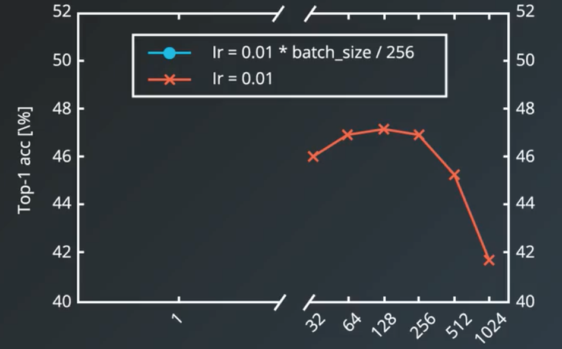
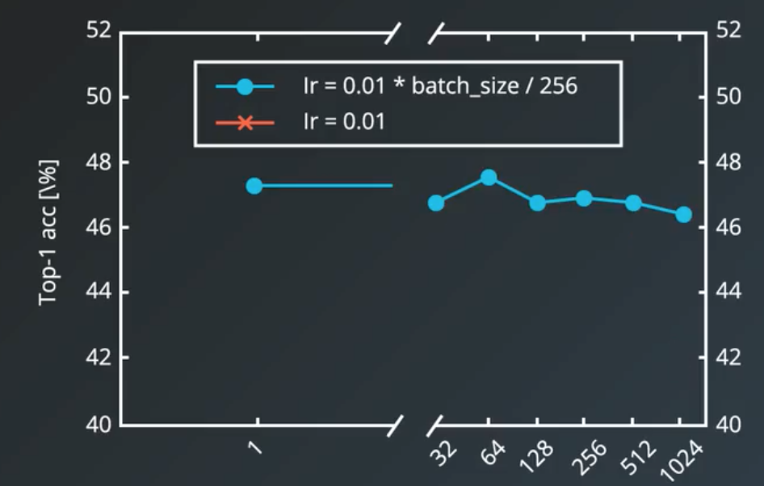
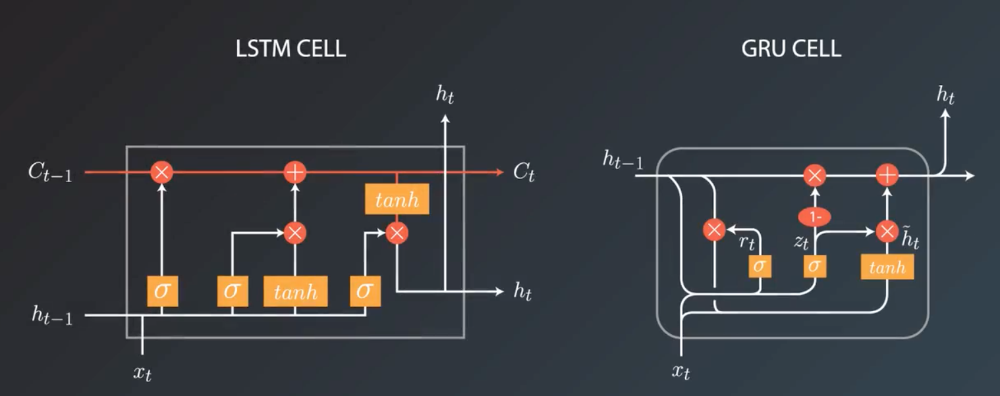
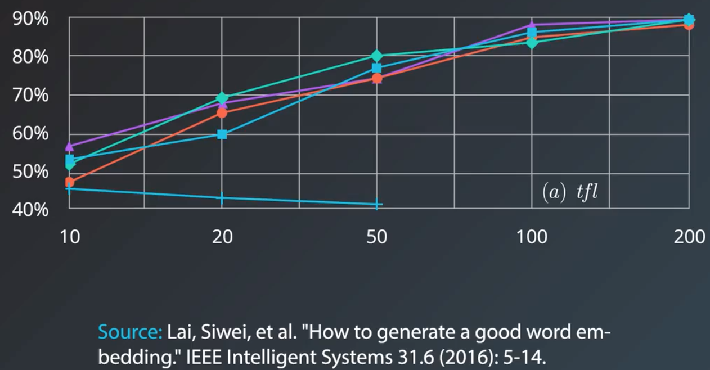
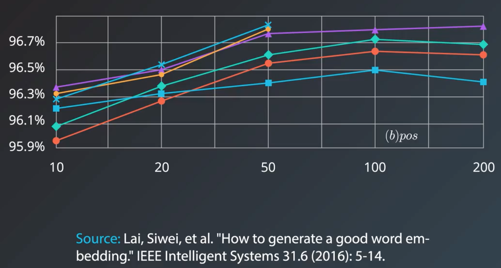

[TOC]

# Hyper Parameter介绍

### 1.1 与opt 相关的

#### 1.1.1 learning rate

1）好的开始：0.01

2）其他常用的：0.1，0.001，0.0001，0.00001，0.000001

3）若 training  loss 增加，有可能是 learning rate 太大；

​	loss 下降太慢（几百个 epoch 都还很高），可能是 learning rate 太小；

4）**learning rate decay**

比如：

每5个 epoch 让 learning rate 减半（*0.5）；

每8个 epoch 让 learning rate *0.1；

5）**Adaptive Learning**

Adam、Adagrad 等

#### 1.1.2 minibatch size

1）历史上，关于 training，有2派争论，

一是 Online(stochastic)，单个sample 训练；（minibatch size =1 ）

一是Batch，whole data set 训练；（minibatch size = max）

2）minibatch 介于二者之间

常用值，32、64、128、256

1、2、4、8、16有些小，会是训练太慢；

512、1024、2048 太大，容易陷入局部极值；

3）选择时的考虑

minibatch size 增加，

优点：收敛速度变快；

缺点：训练噪声变小，容易**陷入局部极值**；

4）若想用很大的 minibatch size，需要调整 learning rate；如下图：

#### 1.1.3 epochs number

1）只要 validation loss 还在下降，就不要停；

2）使用 **early stopping** 方法；

​	一般不是立马停下，有一个 patient 大概10或20 epoch ;

### 1.2 与 model 相关的

#### 1.2.1 layer number

关系学习能力 capacity；

#### 1.2.2 hidden units number

关系学习能力 capacity；

发现 overfit，需要减少该数量；

#### 1.2.3  RNN 超参

##### 1.2.3.1 cell 类型

例如：LSTM、vanilla RNN Cell、Gated recurrent unit(GRU)

一般认为，LSTM 和 GRU 优于 vanilla RNN；

> "除了语言建模，GRU 在所有任务上都胜过了 LSTM"
>
> https://arxiv.org/abs/1412.3555

##### 1.2.3.2 how deep the net

1）stack 多少 layer？

> "我们一致的发现是至少两层的深度是有益的。但是，在两层和三层之间，我们的结果不太一致。此外，LSTM 和 GRU 之间的结果也不一致，但都显著优于 RNN。"
>
> http://proceedings.mlr.press/v37/jozefowicz15.pdf

2）word embedding 的维度？

> 在有些数据集上，embedding size 越大越好（至少200是可行的）。

> 但在有些数据集上，增大到50后，就无所增益了。

感觉是由于问题简单，到50时，准确率就已经非常高了。

**RNN 架构示例**

|       应用       | Cell |    层    |      大小       |        词汇         | 嵌入大小  |  学习率  |                                          |
| :------------: | :--: | :-----: | :-----------: | :---------------: | :---: | :---: | :--------------------------------------: |
|   语音识别（大词汇表）   | LSTM |  5, 7   |   600, 1000   |     82K, 500K     |  --   |  --   | [paper](https://arxiv.org/abs/1610.09975) |
|      语音识别      | LSTM | 1, 3, 5 |      250      |        --         |  --   | 0.001 | [paper](https://arxiv.org/abs/1303.5778) |
| 机器翻译 (seq2seq) | LSTM |    4    |     1000      | 原词汇：160K，目标词汇：80K | 1,000 |  --   | [paper](https://arxiv.org/abs/1409.3215) |
|      图片字幕      | LSTM |   --    |      512      |        --         |  512  | (固定)  | [paper](https://arxiv.org/abs/1411.4555) |
|      图像生成      | LSTM |   --    | 256, 400, 800 |        --         |  --   |  --   | [paper](https://arxiv.org/abs/1502.04623) |
|      问题回答      | LSTM |    2    |      500      |        --         |  300  |  --   | [pdf](http://www.aclweb.org/anthology/P15-2116) |
|      文本总结      | GRU  |         |      200      | 原词汇：119K，目标词汇：68K |  100  | 0.001 | [pdf](https://pdfs.semanticscholar.org/3fbc/45152f20403266b02c4c2adab26fb367522d.pdf) |

